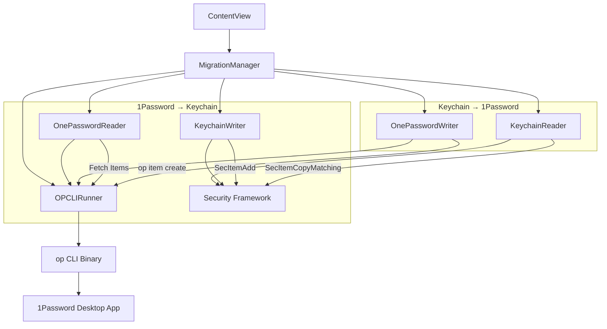
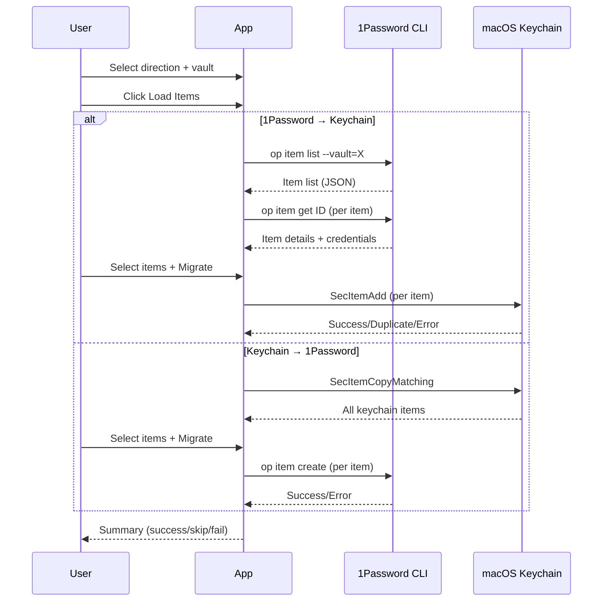

# KeychainTo1Password

> **Note:** This app is currently a work in progress and does not function yet. Do not rely on it for actual password migration.

Bidirectional migration tool for macOS: move passwords between **1Password** and the native **macOS Keychain (Passwords app)**.

Written by Jordan Koch.


## Features

- **1Password → Keychain** — Import login credentials from any 1Password vault into macOS Keychain/Passwords
- **Keychain → 1Password** — Export macOS Keychain items to a 1Password vault
- **Item Selection** — Browse and select individual items to migrate (select all / none)
- **Duplicate Handling** — Skip or overwrite existing entries
- **All Item Types** — Internet passwords, generic passwords, WiFi networks, certificates, keys, identities
- **No Service Account Required** — Uses 1Password desktop app integration (biometric auth)
- **Dark Mode UI** — Glassmorphic design with progress tracking

## Requirements

- macOS 14.0+
- [1Password CLI](https://developer.1password.com/docs/cli/) (`brew install 1password-cli`)
- 1Password desktop app with **CLI integration enabled** (Settings → Developer → "Integrate with 1Password CLI")

## Installation

Download the latest DMG from [Releases](https://github.com/kochj23/KeychainTo1Password/releases) or build from source:

```bash
git clone git@github.com:kochj23/KeychainTo1Password.git
cd KeychainTo1Password
xcodebuild -scheme KeychainTo1Password -configuration Release build
```

## Usage

1. Open the app
2. Select migration direction:
   - **1Password → Keychain** to import into Passwords app
   - **Keychain → 1Password** to export to a vault
3. Select your 1Password vault
4. Click **Load Items** to scan available items
5. Select/deselect items you want to migrate
6. Click the migrate button

## Architecture





## Project Structure

```
KeychainTo1Password/
├── KeychainTo1PasswordApp.swift    # App entry point
├── Models/
│   ├── KeychainItem.swift          # Unified keychain item model
│   ├── MigrationState.swift        # Progress tracking state
│   └── OPVault.swift               # 1Password vault model
├── Services/
│   ├── OPCLIRunner.swift           # Shared op CLI process runner
│   ├── KeychainReader.swift        # Reads from macOS Keychain
│   ├── KeychainWriter.swift        # Writes to macOS Keychain
│   ├── OnePasswordReader.swift     # Reads from 1Password vaults
│   ├── OnePasswordWriter.swift     # Writes to 1Password vaults
│   ├── MigrationManager.swift      # Orchestrates bidirectional migration
│   └── Protocols.swift             # DI protocols for testability
└── Views/
    ├── ContentView.swift           # Main UI with all cards
    └── DesignSystem.swift          # Colors, glass cards, buttons
```

## Security

- **No sandbox** — requires full Keychain access for reading/writing
- **No credentials stored** — uses 1Password desktop app biometric integration
- **Local only** — no network calls except to local `op` CLI
- Passwords are never logged or written to disk

## Version History

| Version | Date | Changes |
|---------|------|---------|
| 2.0.0 | 2026-05-14 | Bidirectional migration, item selection UI, removed service account requirement |
| 1.0.0 | 2026-05-14 | Initial release (Keychain → 1Password only) |

## License

MIT License — see [LICENSE](LICENSE)
